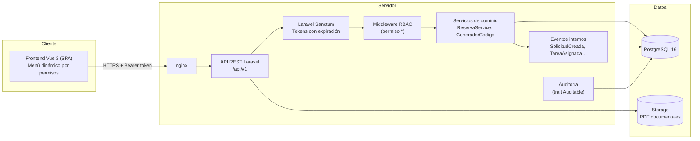
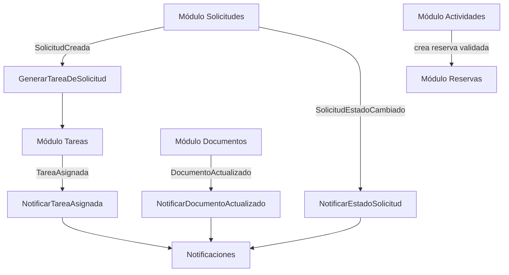

# SIGEP-CACCO · Arquitectura del sistema

**Sistema Integral de Gestión Pública del Centro de Arte y Cultura de Colón**
Versión 1.0 (MVP) · Multiusuario (~40 usuarios iniciales) · Modular, escalable y auditable.

## 1. Visión general

Arquitectura de tres capas con API REST como frontera única entre presentación y negocio:



## 2. Módulos del MVP

| Módulo | Responsabilidad | Prefijo de código |
|---|---|---|
| Administración de usuarios | Usuarios, oficinas, roles y permisos (RBAC configurable) | — |
| Gestión de solicitudes | Flujo institucional con 7 estados y aprobaciones | `SOL-AAAA-NNNN` |
| Gestión de actividades | Cursos, festivales, exposiciones, reuniones, talleres, programas | `ACT-AAAA-NNNN` |
| Gestión de espacios | Teatro, auditorio, galería, salones, aulas, patios | `ESP-AAAA-NNNN` |
| Reservas | Control obligatorio de doble reserva | `RES-AAAA-NNNN` |
| Bandeja de tareas | Tareas personales generadas por solicitudes/actividades o manuales | `TAR-AAAA-NNNN` |
| Gestión documental | Cartas, memos, circulares, actas, contratos, invitaciones; versiones PDF | `DOC-AAAA-NNNN` |
| Calendario institucional | Vista unificada de actividades, reservas y mantenimientos | — |
| Dashboard ejecutivo | Indicadores en tiempo real | — |
| Notificaciones | Campana interna con contador de pendientes | — |
| Auditoría | Bitácora institucional completa | — |

Los identificadores institucionales se generan en `App\Support\GeneradorCodigo`
con secuencias por prefijo y año protegidas con bloqueo pesimista
(`SELECT … FOR UPDATE`), garantizando unicidad bajo concurrencia.

## 3. Comunicación entre módulos (eventos internos)

Los módulos no se llaman directamente entre sí: publican eventos de dominio
que otros módulos escuchan. Esto mantiene el acoplamiento bajo y prepara el
sistema para crecer (los eventos pueden volverse colas asíncronas sin cambiar
los emisores).



## 4. Capas del backend

```
app/
├── Http/
│   ├── Controllers/Api/   ← Capa de presentación: valida entrada, responde JSON
│   └── Middleware/        ← CheckPermission (RBAC en backend)
├── Services/              ← Lógica de negocio (ReservaService: doble reserva)
├── Events/ Listeners/     ← Comunicación entre módulos
├── Models/                ← Entidades Eloquent + reglas de transición de estados
└── Support/               ← Auditable (trazabilidad), GeneradorCodigo
```

Principios aplicados:

- **SRP**: cada controlador atiende un solo recurso; la lógica de conflicto de
  reservas vive únicamente en `ReservaService`.
- **Abierto/cerrado**: nuevos módulos se agregan con nuevos permisos + rutas,
  sin tocar los existentes.
- **Mínimo privilegio**: ninguna ruta protegida confía en el frontend; todo
  pasa por `auth:sanctum` + `permiso:<clave>`.
- **Soft delete universal**: ningún registro de negocio se elimina físicamente.

## 5. Seguridad

| Amenaza | Mitigación |
|---|---|
| SQL Injection | Eloquent/Query Builder con consultas parametrizadas en el 100 % del código |
| XSS | Vue escapa la interpolación por defecto; no se usa `v-html`; API solo JSON |
| CSRF | Autenticación por token Bearer (sin cookies de sesión para la API) |
| Session hijacking | Tokens con expiración configurable (8 h por defecto), renovación explícita (`/auth/renovar`), revocación en logout, token en `sessionStorage` |
| Fuerza bruta | `throttle:5,1` por IP en login + bloqueo de cuenta 15 min tras 5 intentos fallidos |
| Escalada de privilegios | Verificación de permisos y de estado `activo` en cada petición |
| Contraseñas | Hash bcrypt (12 rondas); política de mínimo 10 caracteres con letras y números |

Toda acción de seguridad (login, logout, intento fallido, bloqueo, renovación)
queda en `audit_logs` con fecha/hora, usuario, acción, IP, user-agent y módulo.

## 6. Auditoría y trazabilidad

- El trait `App\Support\Auditable` registra creación, edición y eliminación de
  todos los modelos de negocio, conservando **valor anterior**, **valor nuevo**
  y **usuario responsable**.
- Acciones de flujo (aprobación, rechazo, asignación, cierre) se registran
  además de forma explícita con su motivo.
- Los registros usan **soft delete**: la baja es lógica y el historial completo
  permanece consultable en el módulo Auditoría.

## 7. Preparación para el futuro

La estructura ya contempla las integraciones planificadas, sin implementarlas:

| Integración futura | Punto de extensión previsto |
|---|---|
| Comunicaciones / RRHH / Inventario / Desarrollo Social / Gestión Cultural | Nuevo módulo = nuevas tablas + permisos `modulo.*` + rutas + vista; el menú se construye solo desde los permisos |
| Firma electrónica | `documento_versiones` admite metadatos por versión; agregar tabla `firmas` referenciando la versión |
| Portal ciudadano | La API versionada (`/api/v1`) permite exponer un subconjunto público en `/api/publico` sin tocar el núcleo |
| Power BI | Lectura directa de PostgreSQL con un usuario de solo lectura, o exportación por API |
| Microsoft 365 | Los eventos internos (p. ej. `TareaAsignada`) pueden añadir listeners de correo/Teams sin modificar los emisores |
| API externa | Sanctum ya soporta tokens por cliente con habilidades (`abilities`) restringidas |
