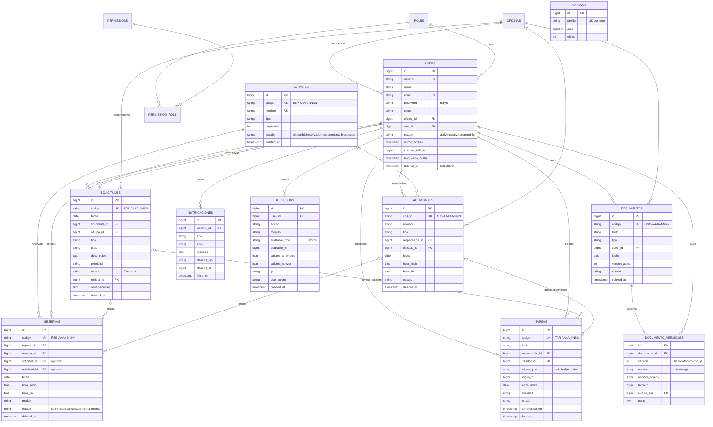

# SIGEP-CACCO · Base de datos y modelo entidad-relación

Motor: **PostgreSQL 16** (desarrollo y pruebas pueden usar SQLite).
Tablas normalizadas (3FN), integridad referencial con claves foráneas e
índices en las columnas de filtrado frecuente (`estado`, `fecha`, `tipo`,
combinado `espacio_id+fecha+estado` para el control de doble reserva).

## Diagrama entidad-relación

## Decisiones de diseño

- **Soft delete (`deleted_at`)** en todas las tablas de negocio: exigencia de
  gestión documental gubernamental — nada se borra físicamente.
- **`codigos`**: secuencia por prefijo y año con `lockForUpdate()`; los códigos
  institucionales nunca se repiten aunque haya inserciones concurrentes.
- **Polimorfismo controlado**: `tareas.origen_*` y `audit_logs.auditable_*`
  usan un *morph map* forzado (`solicitud`, `actividad`, …) para no acoplar la
  base de datos a nombres de clases PHP.
- **Control de doble reserva**: la restricción se valida en
  `ReservaService::verificarDisponibilidad()` dentro de una transacción con
  bloqueo de filas; el índice `(espacio_id, fecha, estado)` la hace O(log n).
  Regla de superposición: `hora_inicio < fin_existente AND hora_fin > inicio_existente`
  sobre el mismo espacio y fecha, ignorando reservas canceladas.
- **`documento_versiones`**: única por `(documento_id, version)`; subir una
  versión nueva jamás sobrescribe archivos anteriores.
- **`audit_logs` sin `updated_at`**: la bitácora es de solo inserción
  (append-only) desde la aplicación.
